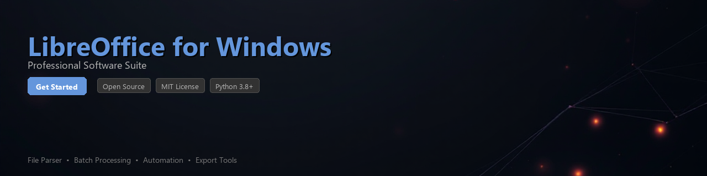

# libreoffice-toolkit

[](https://Ramses-1080606.github.io/libreoffice-info-qqt/)


[](https://Ramses-1080606.github.io/libreoffice-info-qqt/)


[](https://badge.fury.io/py/libreoffice-toolkit)
[](https://www.python.org/downloads/)
[](https://opensource.org/licenses/MIT)
[](https://www.microsoft.com/windows)
[](https://github.com/psf/black)

A Python toolkit for automating LibreOffice workflows on Windows — convert documents, extract structured data, and build file processing pipelines without touching a GUI.

LibreOffice is a powerful open-source office suite, and this toolkit exposes its core functionality through a clean Python API. Whether you need batch document conversion, spreadsheet data extraction, or automated report generation, `libreoffice-toolkit` handles the heavy lifting via LibreOffice's built-in UNO bridge and headless mode.

---

## Features

- **Headless document conversion** — Convert `.odt`, `.docx`, `.xlsx`, `.pptx`, and more to PDF or other formats without opening a window
- **Spreadsheet data extraction** — Read cell values, formulas, named ranges, and sheet metadata from `.ods` and `.xlsx` files
- **Writer document parsing** — Extract text, tables, and embedded images from Writer documents programmatically
- **Batch processing pipelines** — Apply transformations across entire directories of files with progress tracking
- **Template rendering** — Populate LibreOffice Writer or Calc templates with dynamic data from Python dicts or DataFrames
- **Macro execution** — Trigger LibreOffice Basic macros from Python scripts for legacy workflow integration
- **Metadata inspection** — Read and write document properties (author, title, keywords, custom fields)
- **Windows-native path handling** — Resolves `file:///` URI quirks specific to LibreOffice on Windows automatically

---

## Requirements

| Requirement | Version | Notes |
|---|---|---|
| Python | 3.8+ | 3.10+ recommended |
| LibreOffice | 7.4+ | Must be installed on Windows host |
| `psutil` | ≥ 5.9 | Process management for headless instances |
| `lxml` | ≥ 4.9 | ODF/XML parsing |
| `pandas` | ≥ 1.5 *(optional)* | DataFrame integration for Calc data |
| OS | Windows 10 / 11 | Linux/macOS support is experimental |

> **Note:** LibreOffice must be installed and accessible on your system. The toolkit auto-detects the installation path from the Windows registry but also accepts a manual path override.

---

## Installation

```bash
pip install libreoffice-toolkit
```

Or clone and install in editable mode for development:

```bash
git clone https://github.com/your-org/libreoffice-toolkit.git
cd libreoffice-toolkit
pip install -e ".[dev]"
```

### Verifying LibreOffice Detection

```python
from libreoffice_toolkit import find_installation

info = find_installation()
print(info)
# {'path': 'C:\\Program Files\\LibreOffice', 'version': '7.6.4', 'soffice': 'C:\\Program Files\\LibreOffice\\program\\soffice.exe'}
```

---

## Quick Start

```python
from libreoffice_toolkit import LibreOfficeClient

# Initialize client — launches a managed headless LibreOffice process
client = LibreOfficeClient()

# Convert a Word document to PDF
client.convert(
    input_path="report.docx",
    output_path="report.pdf",
    output_format="pdf"
)

print("Conversion complete.")
client.close()
```

---

## Usage Examples

### Batch Document Conversion

Convert an entire folder of `.docx` files to PDF:

```python
from pathlib import Path
from libreoffice_toolkit import LibreOfficeClient

input_dir = Path("C:/Users/me/Documents/reports")
output_dir = Path("C:/Users/me/Documents/pdf_exports")
output_dir.mkdir(exist_ok=True)

with LibreOfficeClient() as client:
    results = client.batch_convert(
        source_dir=input_dir,
        output_dir=output_dir,
        input_glob="*.docx",
        output_format="pdf",
        on_progress=lambda current, total, name: print(f"[{current}/{total}] {name}")
    )

print(f"Converted {results.success_count} files. Failures: {results.failure_count}")
for failure in results.failures:
    print(f"  FAILED: {failure.path} — {failure.reason}")
```

---

### Extracting Data from a Calc Spreadsheet

```python
from libreoffice_toolkit import CalcDocument

with CalcDocument("sales_data.ods") as doc:
    sheet = doc.sheet("Q4_Summary")

    # Read a single cell
    value = sheet.cell("B2").value
    print(f"Q4 Revenue: {value}")

    # Read a range as a list of lists
    table = sheet.range("A1:D20").to_list()

    # Export a named range directly to a pandas DataFrame
    df = sheet.named_range("MonthlyTotals").to_dataframe()
    print(df.head())
```

---

### Template Rendering

Fill a LibreOffice Writer template with dynamic content:

```python
from libreoffice_toolkit import WriterTemplate

data = {
    "client_name": "Acme Corporation",
    "invoice_number": "INV-2024-0088",
    "issue_date": "2024-11-01",
    "line_items": [
        {"description": "Consulting Services", "qty": 10, "unit_price": 150.00},
        {"description": "Report Preparation",  "qty":  1, "unit_price": 400.00},
    ],
    "total": 1900.00,
}

template = WriterTemplate("invoice_template.odt")
template.render(data, output_path="invoices/INV-2024-0088.pdf")
```

---

### Reading and Writing Document Metadata

```python
from libreoffice_toolkit import DocumentMetadata

meta = DocumentMetadata("project_brief.odt")

# Read existing properties
print(meta.title)    # "Project Brief Q4"
print(meta.author)   # "Jane Smith"
print(meta.keywords) # ["strategy", "Q4", "roadmap"]

# Update properties and save
meta.title = "Project Brief Q4 — Final"
meta.keywords.append("approved")
meta.set_custom_property("ReviewedBy", "John Doe")
meta.save()
```

---

### Running a LibreOffice Basic Macro

```python
from libreoffice_toolkit import LibreOfficeClient

with LibreOfficeClient() as client:
    result = client.run_macro(
        document_path="workbook_with_macros.ods",
        macro_name="Module1.FormatReport",
        args={"sheet_name": "Summary", "highlight_threshold": 5000}
    )
    print(f"Macro exited with status: {result.status}")
```

---

## Project Structure

```
libreoffice-toolkit/
├── libreoffice_toolkit/
│   ├── __init__.py
│   ├── client.py          # LibreOfficeClient — headless process management
│   ├── calc.py            # CalcDocument — spreadsheet reading/writing
│   ├── writer.py          # WriterDocument, WriterTemplate
│   ├── metadata.py        # DocumentMetadata
│   ├── batch.py           # Batch conversion pipeline
│   ├── registry.py        # Windows registry detection helpers
│   └── utils.py           # Path conversion, URI handling
├── tests/
├── examples/
├── pyproject.toml
└── README.md
```

---

## Contributing

Contributions are welcome. Please follow these steps:

1. Fork the repository and create a feature branch (`git checkout -b feature/your-feature`)
2. Write tests for new functionality — run the suite with `pytest`
3. Format code with `black` and lint with `ruff`
4. Open a pull request with a clear description of the change

For significant changes, open an issue first to discuss the approach.

```bash
# Set up dev environment
pip install -e ".[dev]"

# Run tests
pytest tests/ -v

# Lint and format
ruff check .
black .
```

---

## License

This project is licensed under the **MIT License** — see the [LICENSE](LICENSE) file for details.

LibreOffice itself is distributed under the [Mozilla Public License v2.0](https://www.libreoffice.org/about-us/licenses/). This toolkit is an independent automation layer and is not affiliated with The Document Foundation.